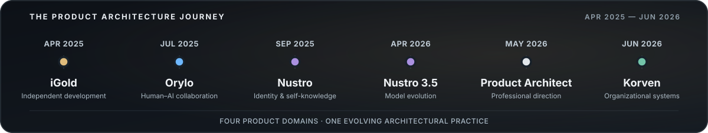
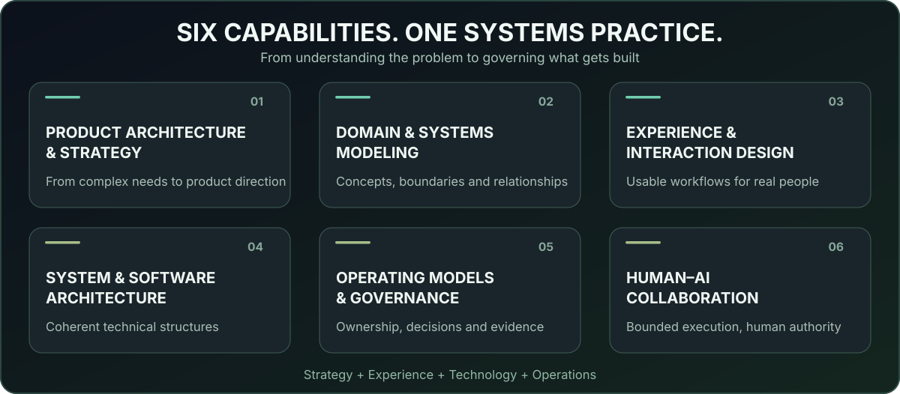
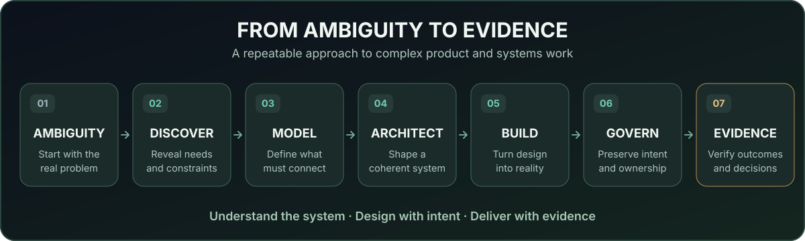

# Ali Alavi

<strong>Product &amp; Systems Architect</strong>

 

<strong>DESIGNING COMPLEX PRODUCTS AND SYSTEMS ACROSS STRATEGY, EXPERIENCE, TECHNOLOGY, AND OPERATIONS.</strong>

  

<em>Connected organizations. Coherent projects. Deeper human understanding.</em>

  

<kbd>Product Architecture</kbd>&nbsp;
<kbd>Domain Modeling</kbd>&nbsp;
<kbd>Systems Design</kbd>&nbsp;
<kbd>Experience Architecture</kbd>&nbsp;
<kbd>Governed Execution</kbd>

 

## About

I design and develop complex digital products and systems — particularly when the problem spans multiple domains and its underlying structure needs to be discovered before it can be built.

My work connects **product strategy, domain modeling, human experience, software architecture, and operating models**. I focus on bringing fragmented activities, information, responsibilities, and decisions into coherent systems that people can understand and use.

That approach now spans **financial markets, collaborative projects, individual insight, and organizational operations**. Different domains, but one consistent architectural question: how can a complex problem become a coherent, usable, and evolving system?

 

## The Path to Product & Systems Architecture

**April 2025 to June 2026.** A transition from employment and freelance work to independent product development, spanning four products and a clearer professional direction.

 

<table>
<tr>
<td width="18%" valign="top"><strong>APR 2025</strong> INDEPENDENT DEVELOPMENT</td>
<td valign="top">

<h3><a href="https://github.com/alaviarts/iGold">iGold™</a></h3>

CRYPTO MARKET INTELLIGENCE &amp; TRADING RESEARCH

I decided to move from employment and freelance work toward building my own products and businesses. A question that emerged from trading became iGold: a platform conceived to investigate developing market movements and support algorithmic decision-making. Pursuing it introduced me to AI-assisted development and accelerated my learning in software and systems architecture.

</td>
</tr>
<tr>
<td valign="top"><strong>JUL 2025</strong> HUMAN + AI COLLABORATION</td>
<td valign="top">

<h3><a href="https://github.com/alaviarts/Orylo">Orylo™</a></h3>

GOVERNED PROJECT DELIVERY

Working with AI agents revealed a new problem: how to coordinate people, agents, decisions, and execution without losing a shared understanding of the project. Orylo took shape as a platform for coherent human–AI collaboration and governed delivery.

</td>
</tr>
<tr>
<td valign="top"><strong>SEP 2025</strong> SELF-KNOWLEDGE</td>
<td valign="top">

<h3><a href="https://github.com/alaviarts/Nustro">Nustro™</a></h3>

MULTIDIMENSIONAL HUMAN INSIGHT

My search for a deeper understanding of my own capabilities led me into cognitive science, self-knowledge, identity, and behavioral patterns. Nustro began as a system for bringing these different perspectives into a coherent understanding of the individual.

</td>
</tr>
<tr>
<td valign="top"><strong>APR 2026</strong> PRODUCT EVOLUTION</td>
<td valign="top">

<h3><a href="https://github.com/alaviarts/Nustro">Nustro™ 3.5</a></h3>

<strong>NDNA™</strong> NUSTRO DNA &nbsp;·&nbsp; <strong>NCCM™</strong> NUSTRO COSMOS COACHING MODEL

This release introduced two core Nustro models: <strong>NDNA</strong>, a persistent reference for multidimensional identity, and <strong>NCCM</strong>, an identity-anchored coaching model that connects self-understanding with current challenges and personal guidance.

</td>
</tr>
<tr>
<td valign="top"><strong>MAY 2026</strong> PROFESSIONAL MILESTONE</td>
<td valign="top">

<h3>Product &amp; Systems Architecture</h3>

DEFINING MY PROFESSIONAL DIRECTION

Using Nustro to examine my thinking, recurring problem-solving patterns, experiences, and skills helped me identify the direction that brought them together: architecting complex products and systems.

</td>
</tr>
<tr>
<td valign="top"><strong>JUN 2026</strong> PROFESSIONAL REPOSITIONING</td>
<td valign="top">

<h3><a href="https://github.com/alaviarts/Korven">Korven™</a></h3>

INTEGRATED ORGANIZATIONAL OPERATIONS

I repositioned my practice around Product &amp; Systems Architecture. In a meeting about a client's organizational needs, this approach led to Korven: a platform conceived to connect organizational structure, business data, operational processes, and information for decision-making.

</td>
</tr>
</table>

<strong>Four products. Four domains. One evolving practice.</strong>

  

<a href="https://github.com/alaviarts/iGold">iGold</a>&nbsp;·&nbsp;
<a href="https://github.com/alaviarts/Orylo">Orylo</a>&nbsp;·&nbsp;
<a href="https://github.com/alaviarts/Nustro">Nustro</a>&nbsp;·&nbsp;
<a href="https://github.com/alaviarts/Korven">Korven</a>

Also exploring <a href="https://github.com/alaviarts/ORBIS">ORBIS</a>, an interconnected view of human knowledge.

 

## What I Do

Six complementary disciplines that connect product direction, human experience, technology, and responsible execution.

 

## How I Work

I begin with the system behind the request: the people involved, the problems to be solved, the relationships that matter, and the information and decisions the product must preserve.

From there, the product experience, technical architecture, and execution model can be developed around one coherent understanding rather than becoming separate interpretations of the same problem.

### Operating Principles

> **Complexity should be modeled before it is automated.**  
> **Architecture should preserve product meaning.**  
> **Execution needs evidence, boundaries, and ownership.**  
> **Technology serves the system — not the other way around.**

 

## Human × AI

AI is a part of my practice, especially in research, analysis, documentation, and governed delivery. It is not the defining feature of every product I build.

I design Human–AI environments in which contribution and authority remain distinct. AI can extend the capacity to investigate, reason, and execute, while product meaning, accountability, and consequential decisions remain under explicit human governance.

 

## Current Focus

<code>Product Architecture</code>&nbsp;
<code>Market Intelligence</code>&nbsp;
<code>Governed Project Delivery</code>&nbsp;
<code>Human Insight Systems</code>&nbsp;
<code>Organizational Operations</code>&nbsp;
<code>Human–AI Collaboration</code>

My product work spans **iGold**, **Orylo**, **Nustro**, and **Korven**: four distinct domains connected by a shared practice of understanding problems, modeling their underlying relationships, and architecting integrated systems.

These projects are evolving at different stages. Their public repositories present the product vision, intended capabilities, and selected conceptual architecture; proprietary implementation remains private.

 

<h2 align="center">Connect</h2>

&nbsp;&nbsp;&nbsp;

  

<em>Art must flow through life.</em>

