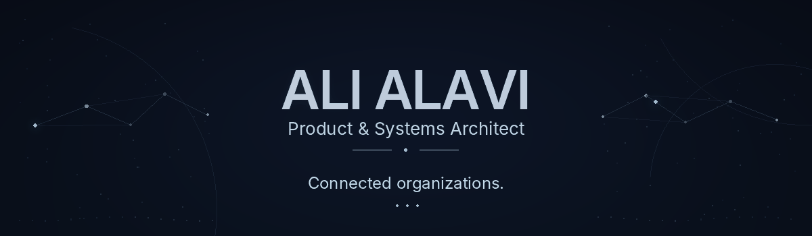
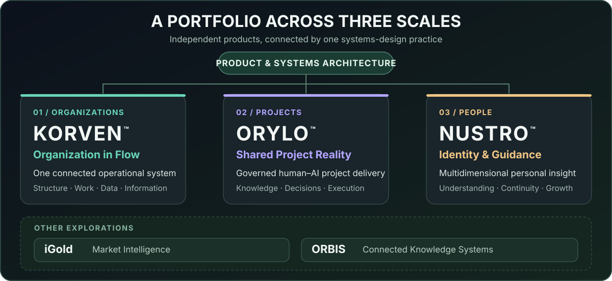

 

<strong>DESIGNING COMPLEX PRODUCTS AND SYSTEMS</strong> 
ACROSS STRATEGY · EXPERIENCE · TECHNOLOGY · OPERATIONS

 

<kbd>Product Architecture</kbd>&nbsp;
<kbd>Domain Modeling</kbd>&nbsp;
<kbd>Systems Design</kbd>&nbsp;
<kbd>Experience Architecture</kbd>&nbsp;
<kbd>Governed Execution</kbd>

 

## About

I design and develop complex digital products and systems — particularly when the problem spans multiple domains and its underlying structure needs to be discovered before it can be built.

My work connects **product strategy, domain modeling, human experience, software architecture, and operating models**. I focus on bringing fragmented activities, information, responsibilities, and decisions into coherent systems that people can understand and use.

That approach runs through my work at different scales: **the organization as one operational system, the project as one shared reality, and the individual as a multidimensional whole**. The products differ, but the architectural question is consistent: how do we preserve meaning and continuity while a complex system evolves?

 

## A Portfolio Across Three Scales

My work spans independent systems for **organizations**, **projects**, and **people**, alongside explorations in market intelligence and connected knowledge.

 

## Featured Systems

Three systems, three scales: **organizations, projects, and people**.

<table>
<tr>
<td width="50%" valign="top">

<h3><a href="https://github.com/alaviarts/Korven">KORVEN™</a></h3>

<strong>Organization in Flow</strong> 
<em>Integrated Organizational Operations Platform</em>

One connected platform designed to bring ERP, CRM, BPM, and other organizational operations into a shared system.

<a href="https://github.com/alaviarts/Korven"><strong>Read more →</strong></a>

</td>
<td width="50%" valign="top">

<h3><a href="https://github.com/alaviarts/Orylo">ORYLO™</a></h3>

<strong>Many Contributors. One Project Reality.</strong> 
<em>Governed Project Delivery Platform</em>

Keeps people, AI, decisions, and execution aligned around one shared project reality.

<a href="https://github.com/alaviarts/Orylo"><strong>Read more →</strong></a>

</td>
</tr>
<tr>
<td colspan="2" valign="top">

<h3><a href="https://github.com/alaviarts/Nustro">NUSTRO™</a></h3>

<em>Multidimensional Human Insight · Identity · Personal Guidance</em>

Connects deeper self-understanding with persistent identity (NDNA™) and identity-anchored coaching (NCCM™).

<a href="https://github.com/alaviarts/Nustro"><strong>Read more →</strong></a>

</td>
</tr>
</table>

 

## Other Explorations

<table>
<tr>
<td width="50%" valign="top">

<h3><a href="https://github.com/alaviarts/iGold">iGold</a></h3>

<em>Market Intelligence Workspace</em>

Local-first crypto market research and analysis.

<a href="https://github.com/alaviarts/iGold"><strong>View repository →</strong></a>

</td>
<td width="50%" valign="top">

<h3><a href="https://github.com/alaviarts/ORBIS">ORBIS</a></h3>

<em>The Solar System of Human Knowledge</em>

Exploring human knowledge as an interconnected system.

<a href="https://github.com/alaviarts/ORBIS"><strong>View repository →</strong></a>

</td>
</tr>
</table>

Public product dossiers for iGold and ORBIS are still being prepared.

 

## What I Do

Six complementary disciplines that connect product direction, human experience, technology, and responsible execution.

 

## How I Work

I begin with the system behind the request: the people involved, the problems to be solved, the relationships that matter, and the information and decisions the product must preserve.

From there, the product experience, technical architecture, and execution model can be developed around one coherent understanding rather than becoming separate interpretations of the same problem.

### Operating Principles

> **Complexity should be modeled before it is automated.**  
> **Architecture should preserve product meaning.**  
> **Execution needs evidence, boundaries, and ownership.**  
> **Technology serves the system — not the other way around.**

 

## Human × AI

AI is a part of my practice, especially in research, analysis, documentation, and governed delivery. It is not the defining feature of every product I build.

I design Human–AI environments in which contribution and authority remain distinct. AI can extend the capacity to investigate, reason, and execute, while product meaning, accountability, and consequential decisions remain under explicit human governance.

 

## Current Focus

<code>Organizational Operations</code>&nbsp;
<code>Governed Project Delivery</code>&nbsp;
<code>Human Insight Systems</code>&nbsp;
<code>Product Architecture</code>&nbsp;
<code>Human–AI Collaboration</code>

My current work centers on developing **Korven**, advancing **Orylo** as a governed delivery platform, and refining **Nustro** as a persistent foundation for personal understanding and guidance.

These systems are under active development. Their public repositories present their product vision, intended capabilities, and selected conceptual architecture; proprietary implementation remains private.

 

<h2 align="center">Connect</h2>

&nbsp;&nbsp;&nbsp;

  

<em>Art must flow through life.</em>

